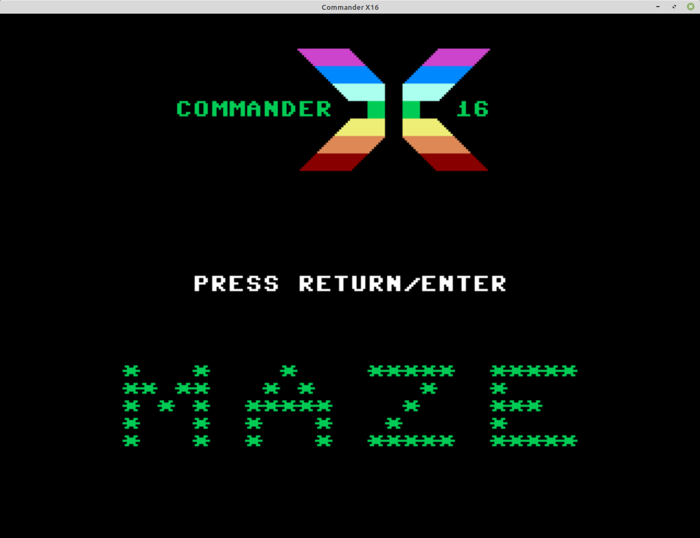

<h1>Commander CX16 maze</h1>
<h2>game inspired by the Android game Amaze.</h2>

For a detailed walkthrough of the early development, please visit <a href="https://techblog.dansbo.dk/?p=218">https://techblog.dansbo.dk/?p=218</a>

Written for the <a href="https://sourceforge.net/projects/acme-crossass/">ACME Cross-Assembler</a> 
Assemble with: <pre>acme -f cbm -o cx16maze.prg cx16-maze.asm</pre>

Or download the .prg file <a href="https://github.com/JimmyDansbo/cx16-maze/raw/master/cx16-maze.prg">here</a>
